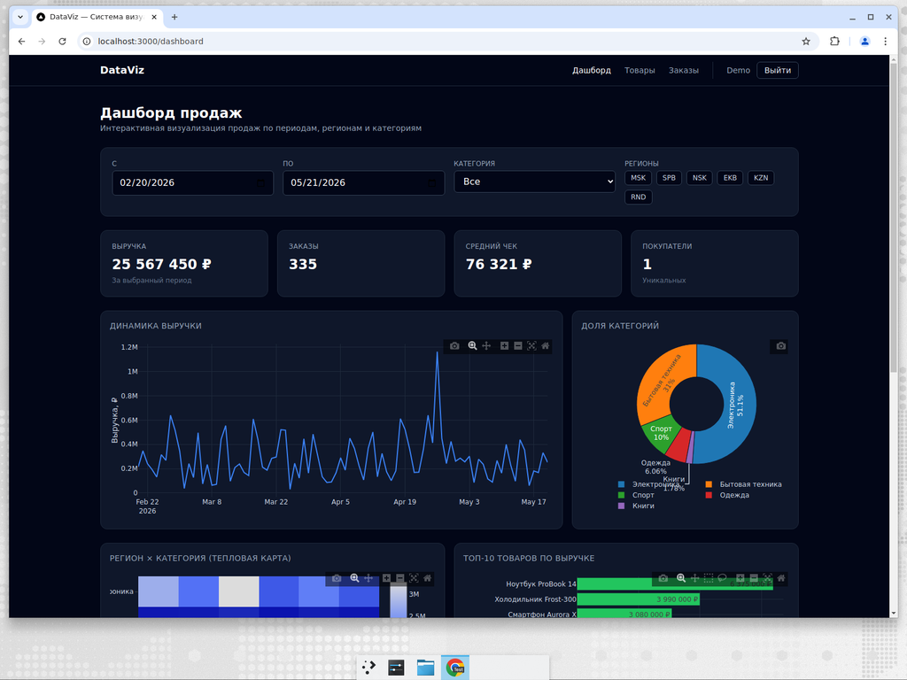

# DataViz — Система визуализации данных

Полнофункциональное приложение к курсовой работе **«Проектирование системы визуализации данных»**.



- **Backend:** ASP.NET Core 8 Web API (C#), Entity Framework Core, PostgreSQL, JWT-аутентификация, Swagger.
- **Frontend:** Next.js 14 (App Router, TypeScript), Tailwind CSS, Plotly.js, SWR.
- **БД:** PostgreSQL 16.
- **Запуск:** Docker Compose (одна команда поднимает БД, API и фронт).

## Структура репозитория

```
dataviz/
├─ backend/
│  ├─ DataViz.sln
│  └─ DataViz.Api/        # ASP.NET Core Web API
│     ├─ Controllers/     # Auth, Categories, Products, Orders, Dashboard, Health
│     ├─ Models/          # User, Category, Product, Order, OrderItem, DashboardView
│     ├─ Dtos/            # DTO для API
│     ├─ Data/            # ApplicationDbContext
│     ├─ Auth/            # JwtOptions, JwtTokenService
│     ├─ Services/        # DataSeeder (категории, товары, ~год заказов)
│     ├─ Migrations/      # EF Core миграции
│     └─ Dockerfile
├─ frontend/              # Next.js 14 + TypeScript + Tailwind
│  ├─ src/app/            # /login, /register, /dashboard, /products, /orders
│  ├─ src/components/     # NavBar, AuthGuard, KpiCard, Plot
│  ├─ src/lib/            # api клиент, JWT хранилище, типы
│  └─ Dockerfile
├─ docker-compose.yml
├─ .env.example
└─ README.md
```

## Быстрый запуск (Docker Compose)

Требуется Docker и Docker Compose v2.

```bash
git clone https://github.com/Amigoqqee/dataviz.git
cd dataviz
cp .env.example .env       # при желании отредактируйте JWT_KEY и пароли
docker compose up --build
```

После сборки доступны:

- Frontend: <http://localhost:3000>
- Backend API: <http://localhost:5080>
- Swagger UI: <http://localhost:5080/swagger>
- PostgreSQL: `localhost:5433` (внутри сети — `db:5432`)

Бэк автоматически:
1. Дожидается готовности PostgreSQL.
2. Применяет EF Core миграции (`InitialCreate`).
3. Заполняет БД сидом: 5 категорий, 20 товаров и ~1500 заказов за последний год.
4. Создаёт демо-пользователя.

**Демо-аккаунт:** `demo@example.com` / `demo12345` (предзаполнен на странице логина).

Останов и очистка:

```bash
docker compose down            # остановить сервисы
docker compose down -v         # удалить и том с данными PostgreSQL
```

## Запуск локально без Docker

### Backend

Требуется .NET SDK 8.0+ и работающий PostgreSQL.

```bash
cd backend/DataViz.Api

# Установите ConnectionStrings:DefaultConnection через user-secrets либо переменную окружения
export ConnectionStrings__DefaultConnection="Host=localhost;Port=5432;Database=dataviz;Username=dataviz;Password=dataviz"

dotnet tool install --global dotnet-ef --version 8.0.10   # один раз
dotnet ef database update                                  # применит миграции
dotnet run --launch-profile http                           # API на http://localhost:5080 (см. Properties/launchSettings.json)
```

### Frontend

Требуется Node.js 20+.

```bash
cd frontend
npm install
NEXT_PUBLIC_API_BASE=http://localhost:5080 npm run dev   # http://localhost:3000
```

## API: основные эндпоинты

| Метод | URL | Описание |
|------|-----|----------|
| POST | `/api/auth/register` | Регистрация (name, email, password) → JWT |
| POST | `/api/auth/login` | Логин → JWT |
| GET  | `/api/auth/me` | Профиль текущего пользователя (нужен Bearer) |
| GET  | `/api/categories` | Список категорий |
| GET  | `/api/products` | Список товаров (фильтр `?categoryId=`) |
| GET  | `/api/orders` | Заказы текущего пользователя (auth) |
| POST | `/api/orders` | Создать заказ (auth) |
| GET  | `/api/dashboard/sales` | Агрегаты для дашборда: KPI, ряды, доли категорий, тепловая карта регион×категория, топ-10 товаров. Фильтры: `from`, `to`, `regions`, `categoryId` (auth) |
| GET  | `/api/health` | Проверка живости |

Полная спецификация доступна в Swagger UI.

## Дашборд (frontend)

- KPI: выручка, число заказов, средний чек, уникальные клиенты.
- График «Динамика выручки» (line chart, Plotly).
- Pie chart «Доля категорий».
- Heatmap «Регион × Категория».
- Bar chart «Топ-10 товаров по выручке» + соответствующая таблица.
- Фильтры: диапазон дат, мультивыбор регионов, выбор категории.

Авторизация хранится в `localStorage` (Bearer-токен). Запросы к API делаются через единый `api()`-клиент в `frontend/src/lib/api.ts`.

## Переменные окружения

См. `.env.example`. Главные значения:

- `JWT_KEY` — секрет для подписи JWT (≥ 32 байта). **Обязательно поменяйте в проде.**
- `POSTGRES_*` — креды БД.
- `NEXT_PUBLIC_API_BASE` — где фронт ищет API (по умолчанию `http://localhost:5080`).
- `CORS_ORIGINS` — список разрешённых Origin для бэка (через запятую).

## Курсовая работа

Текст курсовой работы — `courseArsen2DataViz.docx` (передаётся отдельно).
